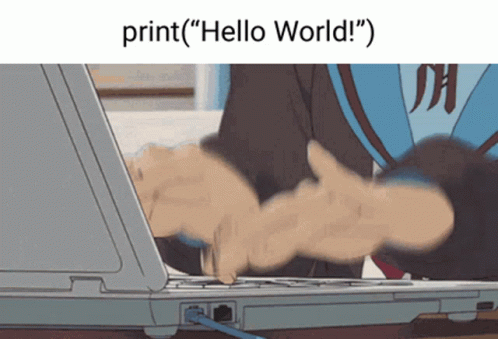

<div align="center">

<!-- OPTIONAL: Put your own anime / cyberpunk GIF at assets/main.gif -->


<br/><br/>

<a href="https://git.io/typing-svg">
  
</a>

<br/>

<a href="https://tanvirazad.netlify.app">
  
</a>

<a href="https://www.linkedin.com/in/tanvir-azad-0600aa276">
  
</a>

<a href="mailto:tanvirazadmahir@gmail.com">
  
</a>

<a href="https://www.kaggle.com/tanvirazadmahir01">
  
</a>

<br/><br/>


</div>

---

## 👻 A little about me...

[](https://github.com/Jurredr/github-widgetbox)

I am a **Computer Science & Engineering undergraduate** focused on **Data Science, Machine Learning and Artificial Intelligence**.

I enjoy building systems that combine **deep learning, computer vision, NLP, OCR, IoT and practical software engineering**. My goal is to turn research ideas into intelligent tools that solve real-world problems.

At the moment, I am especially interested in:

- 🧠 **Artificial Intelligence & Machine Learning**
- 👁️ **Computer Vision & OCR**
- 🗣️ **NLP, Transformers & Speech AI**
- 🔬 **Responsible AI & grounded generation**
- ⚙️ **Intelligent systems and applied research**

```ts
const TANVIR = {
  location: "Dhaka, Bangladesh 🇧🇩",
  education: "BSc in Computer Science & Engineering @ UIU",

  languages: {
    strong: ["Python"],
    comfortable: ["C", "C++", "Java", "JavaScript"],
    web: ["PHP"]
  },

  ai_ml: [
    "CNN",
    "RNN",
    "LSTM",
    "BiLSTM",
    "Transformers",
    "NLP",
    "Computer Vision",
    "OCR"
  ],

  data: [
    "Pandas",
    "NumPy",
    "Matplotlib",
    "Data Preprocessing",
    "Data Visualization"
  ],

  tools: [
    "Git",
    "GitHub",
    "Jupyter Notebook",
    "Google Colab",
    "VS Code",
    "MySQL",
    "Supabase",
    "Firebase"
  ],

  research: "Grounded Ethical Speech-to-Speech AI",

  goal: "Build useful intelligent systems with real-world impact."
};
```

---

## ⚡ Tech Stack

<div align="center">

### Languages


<br/><br/>

### AI / ML


<br/><br/>


<br/><br/>

### Data & Platforms


<br/><br/>

### Tools


<br/>


</div>

---

## 🏢 Featured Projects (Clickable)

<div align="center">

<table>

<tr>
<td align="center" width="50%">

<a href="https://github.com/Tanvir-Azad-Mahir/handwritten_recognition_system">
  
</a>

</td>

<td align="center" width="50%">

<a href="https://github.com/Tanvir-Azad-Mahir/Smart-Factory">
  
</a>

</td>
</tr>

<tr>
<td align="center" width="50%">

<a href="https://github.com/Tanvir-Azad-Mahir/Ticketron-A-rainway-ticket-management-system">
  
</a>

</td>

<td align="center" width="50%">

<a href="https://github.com/Tanvir-Azad-Mahir?tab=repositories">
  
</a>

<br/><br/>

> More experiments, coursework and research projects are available on my GitHub.

</td>
</tr>

</table>

</div>

> [!NOTE]
> I like projects that combine **research-driven ideas with practical engineering** — especially when AI can improve a real workflow or system.

---

<details open>

<summary><h2>🔬 Research</h2></summary>

### A Grounded Ethical Speech-to-Speech Controversial AI Framework

**Status:** Ongoing

Exploring responsible speech-to-speech AI with emphasis on:

- Grounded generation
- Trustworthy responses
- Ethical handling of sensitive content
- Speech-to-speech reasoning pipelines
- Responsible AI design

```text
Speech Input
    ↓
Context / Grounding
    ↓
Reasoning Layer
    ↓
Ethical Safety Layer
    ↓
Speech Output
```

</details>

---

<details open>

<summary><h2>🏆 Selected Projects</h2></summary>

### ✍️ Handwritten Prescription Recognition System

Built a handwriting-recognition pipeline for medical prescriptions using OCR-based text detection and deep learning.

**Core stack:** `Python` `EasyOCR` `OpenCV` `CNN` `BiLSTM` `CTC`

---

### 🏭 Smart Factory Safety & Intelligent Navigation

Developed an IoT + AI safety prototype for environmental monitoring, access control, automated gate logic and worker rerouting.

**Core stack:** `Python` `C/C++` `ESP32` `Raspberry Pi` `OpenCV`

---

### 🚆 Ticketron — Railway Ticket Management System

Built a database-driven railway booking platform with authentication, search, booking, refunds, printable tickets and a CRUD admin panel.

**Core stack:** `PHP` `MySQL` `HTML` `CSS` `JavaScript`

</details>

---

<details open>

<summary><h2>⚜️ Certifications</h2></summary>

<div align="center">

<a href="https://www.kaggle.com/learn/certification/tanvirazadmahir01/pandas">
  
</a>

<a href="https://www.kaggle.com/learn/certification/tanvirazadmahir01/data-visualization">
  
</a>

</div>

</details>

---

<details open>

<summary><h2>📊 Statistics</h2></summary>

<div align="center">


<br/><br/>


<br/><br/>


<br/><br/>


</div>

</details>

---

## 🌌 Current Arc

<div align="center">

<table>
<tr>

<td align="center" width="25%">

### 🧠 AI
Machine Learning  
Deep Learning  
Intelligent Systems  

</td>

<td align="center" width="25%">

### 👁️ Vision
Computer Vision  
OCR  
Image Processing  

</td>

<td align="center" width="25%">

### 🗣️ Language
NLP  
Transformers  
Speech AI  

</td>

<td align="center" width="25%">

### 🔬 Research
Responsible AI  
Grounding  
Trustworthy Systems  

</td>

</tr>
</table>

</div>

---

## 🤝 Let's Connect

<div align="center">

I'm open to **research collaborations, open-source projects, AI/ML opportunities and technical discussions.**

<br/><br/>

<a href="https://tanvirazad.netlify.app">
  
</a>

<a href="https://www.linkedin.com/in/tanvir-azad-0600aa276">
  
</a>

<a href="mailto:tanvirazadmahir@gmail.com">
  
</a>

</div>

<br/>

<div align="center">

### `Research • Build • Learn • Evolve`


</div>
